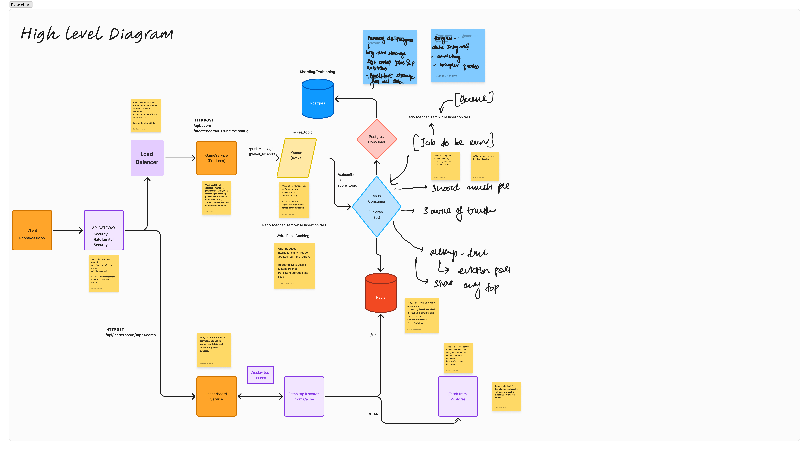
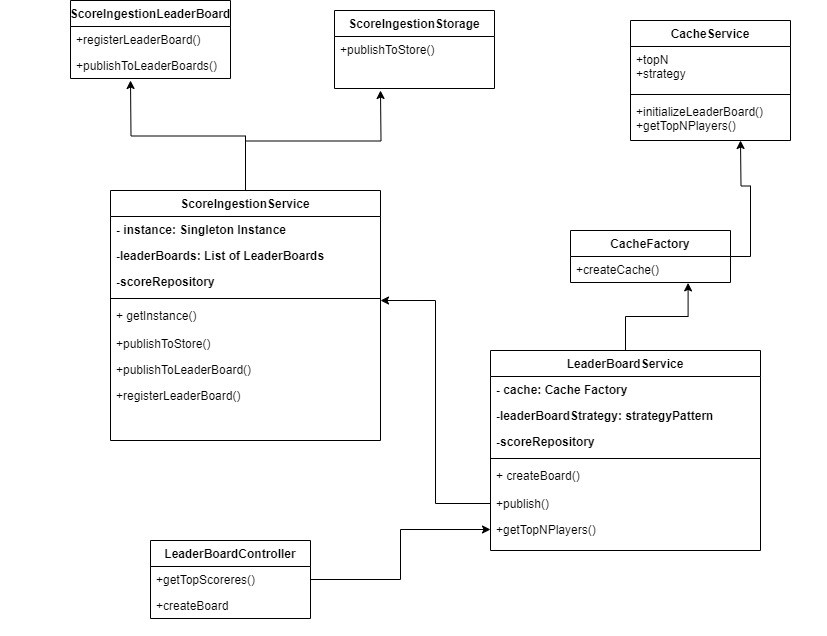
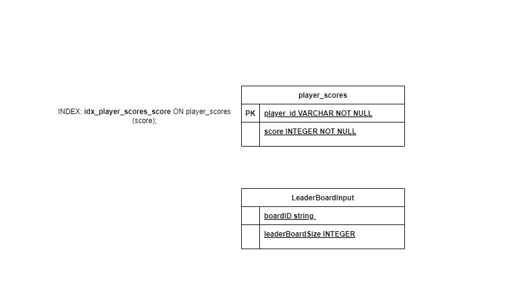

# Project README

## Leaderboard Service

Welcome to the project! This README file will provide you with all the necessary information to get started.
The problem statement for this project is to develop a leaderboard service that allows users to track and display top K rankings based on certain criteria. The application will likely involve features such as adding/registering leaderboard, updating scores, and displaying the leaderboard in a user-friendly format.

## Table of Contents
- [Introduction](#introduction)
- [API](#api)
- [Design](#design)
- [CoreAlgorithm](#core algorithm)
- [Future Scope](#futurescope)
- [Limitations](#limitations)
- [Installation](#installation)
- [Usage](#usage)
- [Contributing](#contributing)
- [License](#license)

## Introduction
In this project, we aim to create a user-friendly and intuitive design for the Leaderboard Service application. Our goal is following:
- **Receive Scores:** Handle scores published by the game service (from a topic or flat file).
- **Store Scores:** Use a database to keep track of these scores.
- **Return Top Scores:** Provide a service that retrieves the top 5 scores and the players' names with those scores.

## API

### POST /api/leaderboard/createBoard
Purpose: Admins can create and register a board of size k
Request Body: JSON object with boardID and leaderBoardSize
Response: Status 201 Created with a message "Leaderboard created successfully" & Status 400 for any bad_request and 500 for any failures

### GET /api/leaderboard/getTopScorers
Purpose: Retrieves the top N scores(JSON), N is fixed while leaderboard registration
Response: Status 200 Fetched with a list of top scorers & Status 400 for any bad_request when the leaderboard is not init/registered and 500 for any failures

### POST /api/game/updateScore
Purpose: Posts a new score for a player_id/user_name
Request Body: JSON object with player_id and score
Response: Status 201 Created and 400 for BAD_REQUEST

### GET /api/health
Purpose: Check if the service and database is up/down
Response: Status 200 Fetched with a status "UP" and 500 with Health Check Failed status "DOWN"

## Design

### Core Algorithm

We are using a combination of **Min Heap and HashMap** to store the player scores. The Min Heap helps us maintain the top K scores efficiently.

### Future Scope

#### Microservices Architecture
Implementing a scalable system where the GameService handles all the meta data (game, players, scores) while the LeaderboardService manages the scoreboard and provides the latest real-time scores.

#### Partitioning
Leaderboard data based on player segments (e.g., game mode, region) for horizontal scaling.

#### Redis and Apache Spark
The top k leaderboard is a category of Heavy Hitter problem where the traffic would be huge. In that case, we would be ingesting data to Apache Spark Pipeline with Map Reduce and process the real-time scores and store in Redis (K Sorted Set). Redis would be a highly great option as compared to the current solution considering the distributed architecture.

#### Notification Service (Optional)
Integrate a notification service to provide real-time updates to users when specific events occur, such as a player reaching the top of the leaderboard.

#### DR Mechanism and Scaling multiregion
Deploying services across multiple regions with distributed LBs. For DR, we can maintain backup data and a DR site/region so that for any issue, we can route to the backup region.

#### Kafka Queue
Utilize Kafka to manage and queue large volumes of concurrent requests, efficiently forwarding them to consumers such as Redis and PostgreSQL.

#### WebSocket
Implement WebSocket communication to deliver real-time updates and enhance the user experience

#### Metrics & Error Handling
Custom Error Handling classes and metrics

#### Reliability 
Monitoring and metrics

#### User Profile Recognition System
Additional Feature to show the top profiles their streak etc

### Limitations

#### Single Point of Failure
The use of a single in-memory cache **(InMemoryCacheService)** can be a single point of failure. If the service crashes, all cached data is lost.

#### Memory Constraints
Storing all player scores in memory can lead to high memory usage, especially with a large number of players.
#### Concurrency Issues
The current implementation may not handle concurrent updates to the cache efficiently, leading to potential race conditions.

#### Scalability
The current design may not scale well with an increasing number of players or games. The in-memory cache is limited by the memory of a single machine.

#### Data Persistence
The cache does not persist data to disk, meaning all data is lost on service restart. This could be mitigated by periodically saving the cache state to a persistent storage.

#### Limited Fault Tolerance
The system relies on centralized logging and a single cache instance, which can be a bottleneck and a single point of failure.

#### Lack of Redundancy
There is no redundancy in the cache layer. If the cache service goes down, there is no backup to take over.

## Installation

To install the Leaderboard Service application, follow these steps:
1. Clone the repository: `git clone https://github.com/your-username/leaderboard-service.git`
2. Install the required dependencies: `npm install`
3. Build the project: `npm run build`
4. Or: `npm run start:dev`

## Usage
To use the Leaderboard Service application, follow these steps:
1. Start the application: `npm run start`
2. Open your web browser and navigate to `http://localhost:3000`
3. Explore the various APIs and functionalities of the application
4. Testing: To ensure the quality of the code, run the tests using the following commands: `npm run test` or `npm run test:cov`

The coverage report can be found in the coverage/lcov-report/index.html file.

## Contributing
We welcome contributions from the community! If you'd like to contribute to the project, please follow these guidelines:
1. Fork the repository
2. Create a new branch: `git checkout -b feature/your-feature-name`
3. Make your changes and commit them: `git commit -m "Add your commit message"`
4. Push your changes to your forked repository: `git push origin feature/your-feature-name`
5. Open a pull request to the main repository

## License
This project is licensed under the [MIT License](LICENSE).

## Installation

To install the Leaderboard Service application, follow these steps:
1. Clone the repository: `git clone https://github.com/your-username/leaderboard-service.git`
2. Install the required dependencies: `npm install`
3. Build the project: `npm run build`
4. Or: `npm run start:dev`

## Usage
To use the Leaderboard Service application, follow these steps:
1. Start the application: `npm run start`
2. Open your web browser and navigate to `http://localhost:3000`
3. Explore the various APIs and functionalities of the application
4. Testing : To ensure the quality of the code, run the tests using the following commands:`npm run test` or `npm run test:cov `

The coverage report can be found in the coverage/lcov-report/index.html file.

## Contributing
We welcome contributions from the community! If you'd like to contribute to the project, please follow these guidelines:
1. Fork the repository
2. Create a new branch: `git checkout -b feature/your-feature-name`
3. Make your changes and commit them: `git commit -m "Add your commit message"`
4. Push your changes to your forked repository: `git push origin feature/your-feature-name`
5. Open a pull request to the main repository

## License
This project is licensed under the [MIT License](LICENSE).
